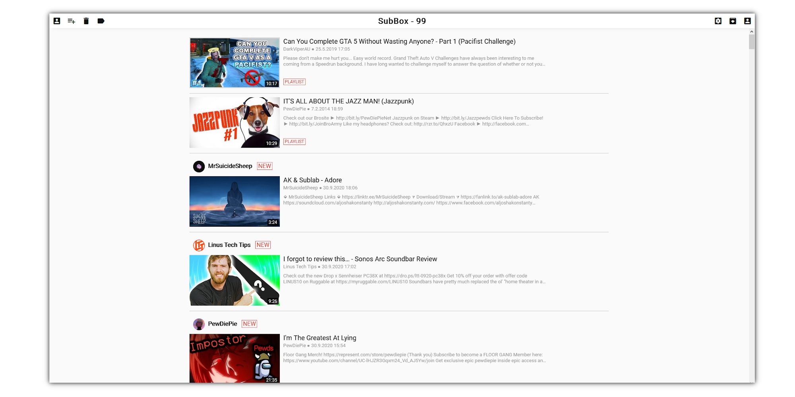
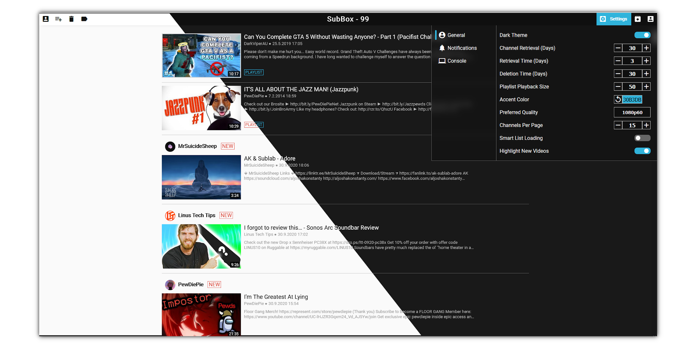

# SubBox [](https://github.com/MilchRatchet/SubBox/releases)
`SubBox` is a tool to manage the uploaded videos of your favourite Youtube channels. It resembles the `Subscriptions` tab on Youtube.




</img>
</img>

All videos can be downloaded and watched later without an internet connection. For this [FFmpeg](https://github.com/FFmpeg/FFmpeg) and [youtube-dl](https://github.com/ytdl-org/youtube-dl) are used on the backend.


# Building

First, you need to create a public class called `Config` which has the following static fields:
``` C#
public static string APIKey =
[Insert your Youtube API key];

public static string UnsplashAPIKey =
[Insert your Unsplash API key];
```
This project can be build using Visual Studio. `SubBox` should download `youtube-dl` and `ffmpeg`. If this does not work, you need to put the executables into `SubBox/`.

Alternatively, you can download one of the release executables.

# Issues

See the `Issues` tab for a list of currently known bugs and feature ideas. As some important functionalities rely on external APIs it is quite likely that things break over time. In that case, it would be helpful to create a new issue in which you describe the bug.


